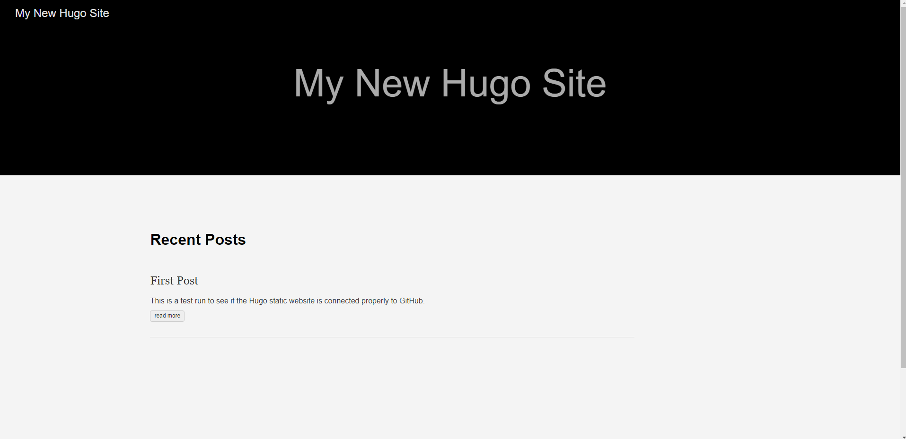
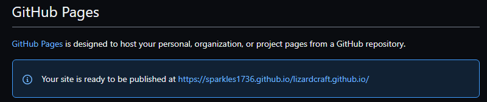
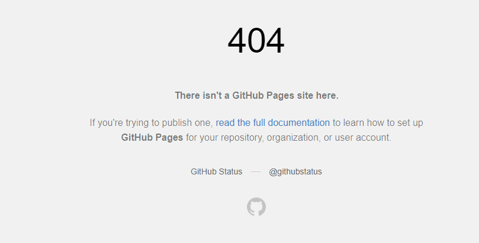

# Entry 3
##### 3/7/2022

## Where Did We Leave Off?

With the last two months, I have slowly working on the intergration from my local desktop to a GitHub pages. It has been a difficult ongoing process to say the least, but it gave me more insight on what I need to work on in the next few days. Trying bring the two together was not as easy as I anticipated but I continue onwards and forwards. On my end, setting up the website and viewing it was simple enough. All I had to do was add a theme shown below: 

## 
and add the text necessary to create a static website that was client side to myself only, which can also be seen below:
## 

While the static set up was fairly straightforward and I used the documentation on the [Hugo](https://gohugo.io/getting-started/usage/#draft-future-and-expired-content) website to edit and change the messages a few times. When working on building the bridge to connect the two together, I found it very difficult to figure out what my next steps were. Even though Hugo has some concrete steps to help connect you and build the metaphorical bridge [seen here](https://gohugo.io/hosting-and-deployment/hosting-on-github/), GitHub has a few problems when trying to connect Hugo to its Pages service. While I would like the domain of the wiki I am making to represent the community itself, GitHub specifically requests that 
> "To publish a **user site**, you `must create a repository owned by your user account that's named <username>.github.io.` To publish an organization site, you must create a repository owned by an organization that's named *<organization>.github.io.* __Unless you're using a custom domain__, user and organization sites are available at *http(s)://<username>.github.io* or *http(s)://<organization>.github.io.*" the link [here](https://docs.github.com/en/pages/getting-started-with-github-pages/about-github-pages#user--organization-pages).

Facing these challenges was not easy and I am still actively working on them as I am writing this. Using Google was very necessary in this step towards sucess. While on my end I would get the message that GitHub pages were working fine and I can access them through my own computer (the respritory link for the final project is [here](https://github.com/Sparkles1736/sparkles1736.github.io) **Note:** I have had to change and delete my files multiple times due to errors in downloading the wrong binaries) 
## 
Whenever I would try to add and push content from my D: drive (where I have my files stored now for better control and space reasons, thank you Google and [MiniTool](https://www.minitool.com/news/how-to-open-drive-in-cmd.html) for teaching me how to do so with my command prompt) the result that would show up on another users end when viewing the GitHub website itself, would see an error (shown below) instead of the client side website I would see myself (shown previously.)
 ## 
 
 ### My Next Steps
This is a problem I plan to tackle by the end of next week when I more throughly figure out and comprehend the work of [peaceiris](https://github.com/peaceiris/actions-gh-pages) and connect my work to GitHub and continue making progress towards my MVP. What I plan on working towards is connecting the two and adding content to make the wiki page A) more alive and B) more useful for the people seeking information.
  
[Previous](entry02.md) | [Next](entry04.md)

[Home](../README.md)
