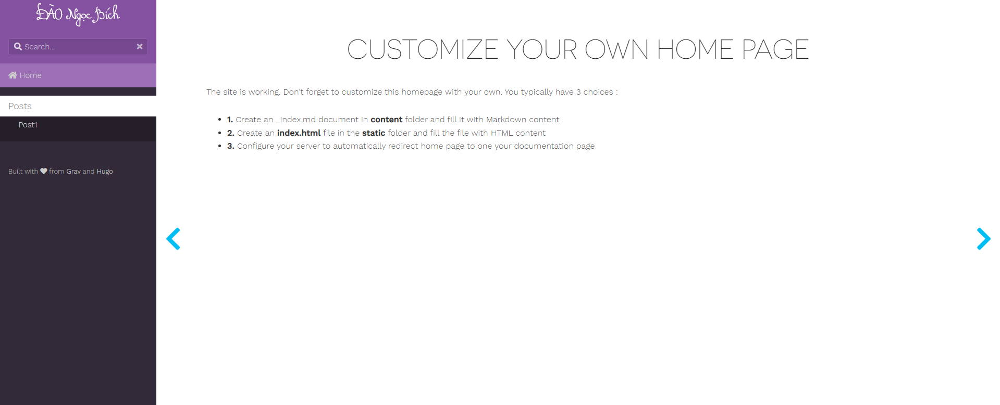

# Entry 4 
##### 3/21/22

While in my last entry I talked about the struggles of connecting my Hugo static website to GitHub pages, I used Google to figure out if there were any sort of guides or videos that would break down the process better into something I can follow more straightforwardly because I tend to be more of a audio/hands-on learner rather than a visual learner. Using a 10 minute video from a fellow developer Ryan Schachte, I followed this [tutorial](https://www.youtube.com/watch?v=LIFvgrRxdt4) on YouTube to help me connect my static website to GitHub, even though it is the wrong file because I chose a different theme. While the website website [linked here](https://sparkles1736.github.io/sparkles.1736.github.io/#) does work, it is drastically different from the images on my local end. 

The two websites are very different in style and in how they look, even to the point of the theme of the website not transfering over, but that is secondary. I wanted to accomplish getting my static website working on GitHub with GitHub pages as the bare minimum for this entry, which the videohelped me to acomplish somewhat. 

[Previous](entry03.md) | [Next](entry05.md)

[Home](../README.md)
