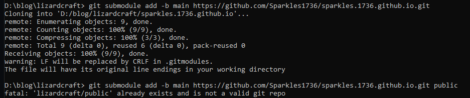

# Entry 4 
##### 3/21/22

While in my last entry I talked about the struggles of connecting my Hugo static website to GitHub pages, I used Google to figure out if there were any sort of guides or videos that would break down the process better into something I can follow more straightforwardly because I tend to be more of an audio/hands-on learner rather than a visual learner. Using a 10-minute video from fellow developer Ryan Schachte, I followed this [tutorial](https://www.youtube.com/watch?v=LIFvgrRxdt4) on YouTube to help me connect my static website to GitHub, even though it is the wrong file because I chose a different theme. While the website [linked here](https://sparkles1736.github.io/sparkles.1736.github.io/#) does work, it is drastically different from the images on my local end.

While the two websites appear different, they do have the same content, even though on the GitHub pages website, it causes a 404 Error. With that said, I want to make it so my pages for the wiki (or the posts) appear on both my end and the users' end; without having the page break down with every click. Ideally, I want to have all the main pages like the navigation and the general overview pages of certain aspects of the server are covered while the smaller points like major details of the plug-ins like the marriage and the community plug-ins come after the MVP.

### What did I learn from this?
I learned how to use `submodules` and connect to different repositories. The code below is used to integrate one (usually empty) repository where you would want your code to appear to another one that already exists that contains the bulk of the work. The image below describes me cloning an empty repository (which now has the static generated website), pushing and pulling code from the repository called **sparkles.1736.github.io**.

Submodules are helpful because they helped clear a lot of the confusion I was getting from the last entry. Even if [peaceiris's](https://github.com/peaceiris/actions-gh-pages) actions plug-in would have helped more smoothly transition the static pages to GitHub Pages, I found that the documentation tended to lose me because I am not the savviest when it comes to new things like GitHub pages. With the YouTube video from Ryan Schachte though, I found I was able to follow very well and created the basic structure of my static website that will become a working wiki page for the LizardCraft Minecraft server. I also learned that using the verbose command `git remote -v` was important to determine where the code was going because the code originally was going into the wrong place, telling me to go over the process again.

[Previous](entry03.md) | [Next](entry05.md)

[Home](../README.md)
